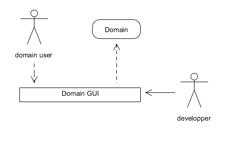
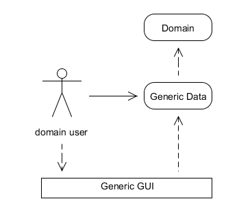
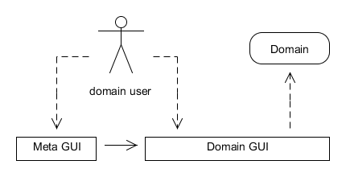

# Meta GUI : a new GUI paradigm

Actually, there exists two types of GUI (Graphical User Interface), domain GUIs (specific application) and Generic GUIs (Excel, ...). We will list here their pros and cons and how we can go beyond them with Meta GUIs a new GUI paradigm.

## Domain GUI
Domain GUIs are GUIs specialized in a particular domain. Every application are in fact a domain GUI. Users are shown screens which are made for the task at hand. Users are domain users which only have to know domain knowledge to use the application. domain GUIs present data as relevant domain knowledge.

Domain GUIs are what domain users want. It is easy to use and all is done out of the box to manipulate domain knowledge as naturally as possible.

The problem is that domain GUIs are specific applications which need to be coded by developpers. It costs time, money and it needs lots of feedback to capture all the requirements.

Developping a new application is too much for lots of domain users which prefers using Generic GUIs, as described in the next section.

## Generic GUI
Generic GUIs are GUIs which can be used independently of domain. Good examples of Generics GUI are Excel or SQL query GUIs. Whatever the domain you are working on, you can use them. They are simple and you don't need a developper. Non-programmers frequently use Generic GUIs when they need a simple and fast means of manipulate their data.

Generic GUIs are good at first. Simple and quick to start with. But more you use them within a specific domain, more you are concerned with a problem : your GUI knows nothing about your domain, only generic data. So, you, as a domain user, are starting to handle all these specific domain rules by hand. You manually do and re-do links between generic data and domain concepts.

## Meta GUI : a synthesis
So, in fact we would like to have GUIs which are domain aware like Domain GUI but we don't want to developp them each time we have a new domain to handle. To accomplish this goal, we need a Meta GUI. Meta GUIs are GUIs where domain users can give domain rules as simply as they enter data in Generic GUIs. With that knowledge, a Meta GUI produces a specific GUI to be used by domain users.

Here's a recap of properties a Meta GUI should have :
- a Meta GUI is given domain concepts and rules by domain users.
- a Meta GUI has an uniform GUI to handle these knowledges. Domain users don't have to re-learn how to use the Meta GUI each time they change domain.
- a Meta GUI generates specific domain GUI from domain knowledge given to it.
- generated GUIs embed domain knowledge. Users can use them as they use specific applications.

