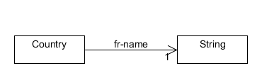

# Example 1 : [SWC2014P] Gestion des équipes
## Expression du Besoin
- créer un pays dont on fournit le 'fr-name'
- lister les pays
- supprimer des pays
- changer le 'fr-name' d'un pays

## Modèle

## Module de compréhension

1. Exprimer ce que je souhaite faire afin que le système me fournisse une IHM
2. Utiliser l'IHM

Contrairement aux systèmes actuels, on rajoute la phase compréhension du besoin. 
avantages : l'IHM de compréhension peut-être la même quel que soit le domaine et ne sera donc à faire qu'une seule fois. Les IHMs seront générées dynamiquement par le système.

## Versions

April 26 2014 10:11 PM : creation
