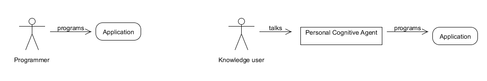

# PCA : Personal Cognitive Agent

## Introduction to PCA
Personal Cognitive Agent is a new way of making software. Instead of programming, we "talk" to an agent who will program for us.

What is different with this project is that it begins from the standard process : an application developped by a clojure programmer. And steps by steps we will introduce a personal cognitive agent to help us doing some of our work.

## Theory
This chapter lists articles which explains ideas behind PCA.

[Meta GUI as a synthesis of Domain and Generic GUIs](GUIs.md)

### Module de compréhension
1. Exprimer ce que je souhaite faire afin que le système me fournisse une IHM
2. Utiliser l'IHM

Contrairement aux systèmes actuels, on rajoute la phase compréhension du besoin. 
avantages : l'IHM de compréhension peut-être la même quel que soit le domaine et ne sera donc à faire qu'une seule fois. Les IHMs seront générées dynamiquement par le système.

## Examples

- Example 1 : [modele](example-001.md)

